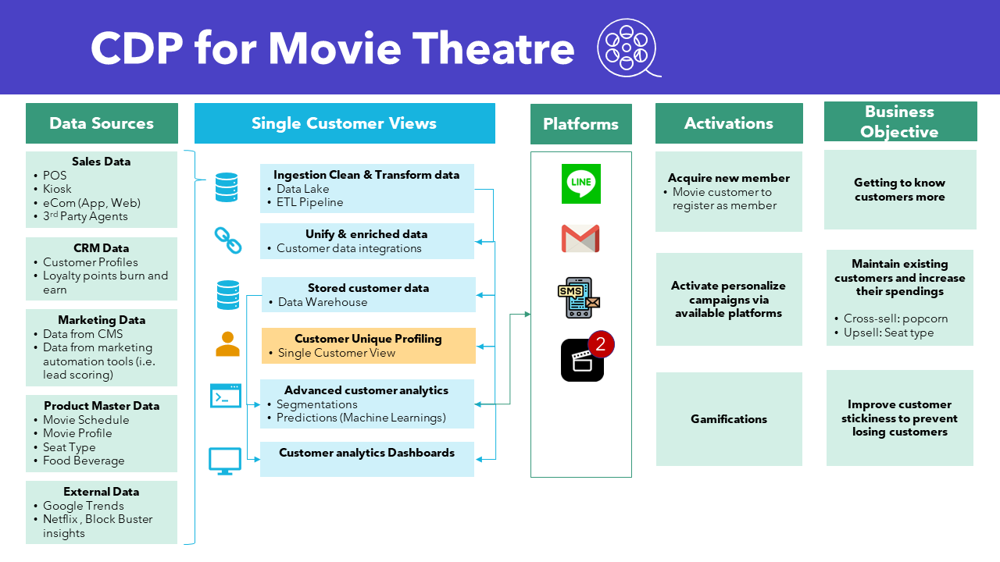
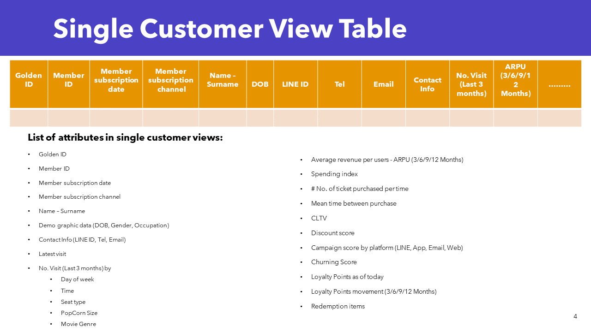

# Customer Data Platform
 
#### My design of customer data platform for a movie theatre (Cinema). The design include single customer view table and provide an example of its use case
## Customer Data Platform Design 

## Single Customer View Table

## Example of single customer view use case
1. Finding gatekeepers by filtering customers who has high # no. of ticket purchased per time and high campaign index. This mean that they are often coming with friends or family and highly sensity to campaign. Hence, we assume that they will likely recommend their friends and family to become member with the right incentives. 
2. Grouping these gatekeeper using clustering techniques using features in single customer views table. 
3. The results will be used to profile each cluster and designed customized campaign by clusters
4. A/B testing will be applied to test between choosen gatekeepers and one who do not recieved the campaign. Technique such as different in differences can also be applied to compare the effect before and after the campaign.
5. Dashboard will also be designed to monitor the performance. KPIs included in the dashboard are CAC, Views, Click, Subsciption success rate. 
