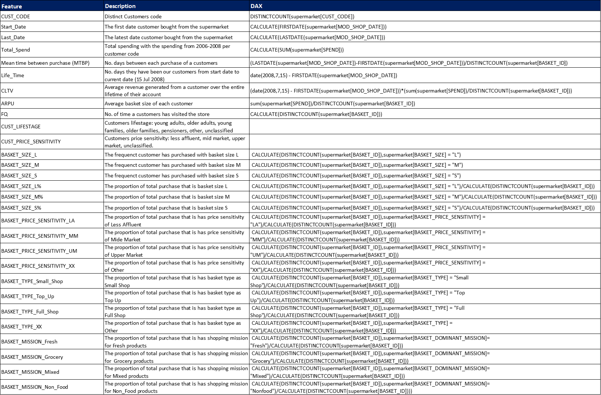

# Customer Segmentation
     

## 1) Import Dataset
The given Supermarket dataset contains 956K rows of sales transactions at sales-item level. The data include historical data from year 2006 to 2008.
We initially explore the data and found that members contributes to 85% of total sales. Hence, we want to segment customers into groups so that the supermarket have behaviour insights and able to customize the approach for each segment. 

## 2) Generate Customer Single View
Total 3,439 customers

## 3) K-Means Clustering
**Notebooks:** [K-Means Model](./Revise_of_Supermarket_Clustering.ipynb)  
**Google Colab:** 
#### Features
All the features are taken from single customer view table
##### Overall Behaviour
* `FQ`: No. of time a customers has visited the supermarket
* `Total_Spend`: Total spending with the spending from 2006-2008 per customer code
* `MTBP` : Meantime between purchase 
* `Life_Time` : No. days they have been our customers from start date to current date (15 Jul 2008)
* `ARPU` : Average basket size of each customer
* `CLTV` : Average revenue generated from a customer over the entire lifetime of their account
* `MOD_CUST_LIFESTAGE_CD` : Customers lifestage: young adults, older adults, young families, older families, pensioners, other, unclassified
* `MOD_CUST_PRICE_SENSITIVITY_CD` : Customers price sensitivity: less affluent, mid market, upper market, unclassified. 
##### Price sensitivity Ratio
* `BASKET_PRICE_SENSITIVITY_LA` : The proportion of total purchase that is has price sensitivity of Less Affluent.
* `BASKET_PRICE_SENSITIVITY_MM` : The proportion of total purchase that is has price sensitivity of Mid Market.
* `BASKET_PRICE_SENSITIVITY_UM` : The proportion of total purchase that is has price sensitivity of Upper Market.
* `BASKET_PRICE_SENSITIVITY_XX` : The proportion of total purchase that is has price sensitivity of Unclassified.
##### Basket Type Ratio
* `BASKET_TYPE_Small_Shop` : The proportion of total purchase that is has basket type as Small Shop.
* `BASKET_TYPE_Top_Up` : The proportion of total purchase that is has basket type as Top Up.
* `BASKET_TYPE_Full_Shop` : The proportion of total purchase that is has basket type as Full Shop.
* `BASKET_TYPE_XX` : The proportion of total purchase that is has basket type as Unclassified. 
##### Mission Ratio
* `BASKET_MISSION_Fresh` : The proportion of total purchase that is has shopping mission for Fresh products.
* `BASKET_MISSION_Grocery` : The proportion of total purchase that is has shopping mission for Grocery products.
* `BASKET_MISSION_Mixed` : The proportion of total purchase that is has shopping mission for Mixed category products.
* `BASKET_MISSION_Non_Food` : The proportion of total purchase that is has shopping mission for Non Food products.
##### Basket Size Ratio
* `BASKET_SIZE_L%` : The proportion of total purchase that is basket size L.
* `BASKET_SIZE_M%` : The proportion of total purchase that is basket size M.
* `BASKET_SIZE_S%` : The proportion of total purchase that is basket size S. 
 
#### Choosing K number of clusters
Choose `K = 4` with the lowest silhoette score of 0.11

#### Clustering Result

## 4) Clustering Result Analysis
**Notebooks:** [Clustering Result EDA](./Revise_Clustering_Result.ipynb)  
**Google Colab:** 

#### EDA
##### Describe Features

##### KDE

##### Bloxplot

#### Feature Importance
With the cluster labels as classes to predict, train a Random Forest classifier.
 
## 5) Interpretation
