# Customer Segmentation
     

The diagram below describes how this project was implemented.

## 1) Import Dataset
The given Supermarket dataset contains 956K rows of sales transactions at sales-item level. The data include historical data from year 2006 to 2008.
We initially explore the data and found that members contributes to 85% of total sales. Hence, we want to segment customers into groups so that the supermarket have behaviour insights and able to customize the approach for each segment. 
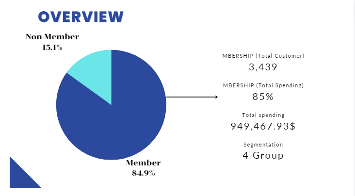

## 2) Generate Customer Single View
Total 3,439 customers
## 3) K-Means Clustering
**Notebooks:** [K-Means Model](./Revise_of_Supermarket_Clustering.ipynb)  
**Google Colab:** 
#### Features
##### Overall Behaviour
* `FQ`
* `Total_Spend`
* `MTBP`
* `Life_Time`
* `ARPU`
* `CLTV`
* `MOD_CUST_LIFESTAGE_CD`
* `MOD_CUST_PRICE_SENSITIVITY_CD`
##### Price sensitivity Ratio
* `BASKET_PRICE_SENSITIVITY_LA`
* `BASKET_PRICE_SENSITIVITY_MM`
* `BASKET_PRICE_SENSITIVITY_UM`
* `BASKET_PRICE_SENSITIVITY_XX`
##### Basket Type Ratio
* `BASKET_TYPE_Small_Shop`
* `BASKET_TYPE_Top_Up`
* `BASKET_TYPE_Full_Shop`
* `BASKET_TYPE_XX`
##### Mission Ratio
* `BASKET_MISSION_Fresh`
* `BASKET_MISSION_Grocery`
* `BASKET_MISSION_Mixed`
* `BASKET_MISSION_Non_Food`
##### Basket Size Ratio
* `BASKET_SIZE_L%`
* `BASKET_SIZE_M%`
* `BASKET_SIZE_S%` 
 
#### Choosing K number of clusters
Choose `K = 4` with the lowest silhoette score of 0.11
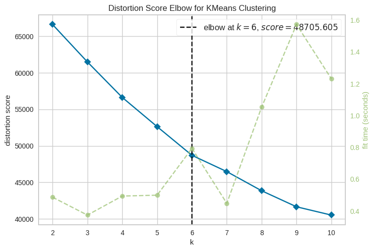
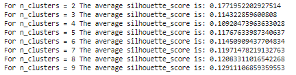
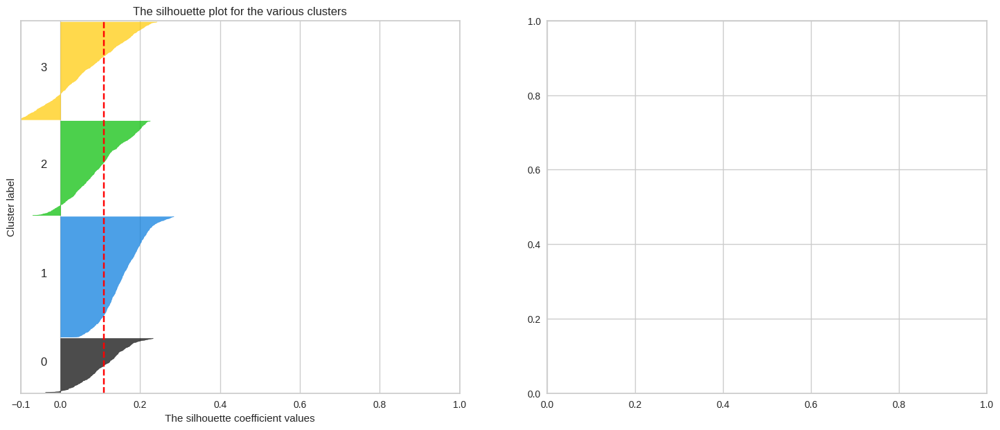

#### Clustering Result
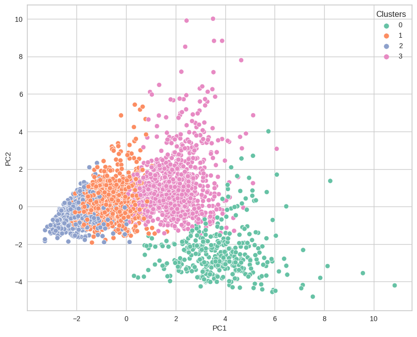

## 4) Clustering Result Analysis
**Notebooks:** [Clustering Result EDA](./Revise_Clustering_Result.ipynb)  
**Google Colab:** 

#### EDA
##### Describe Features
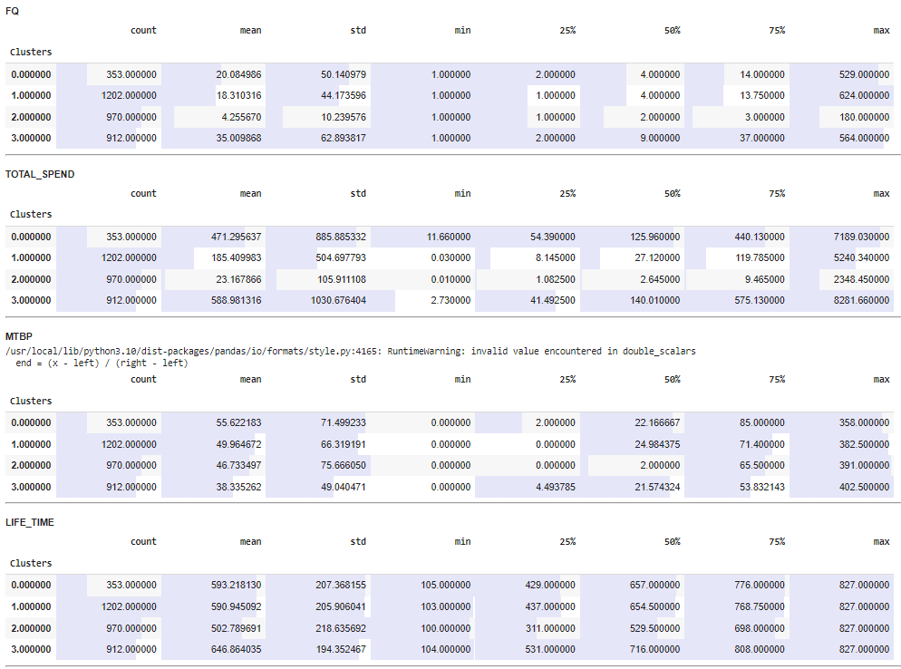
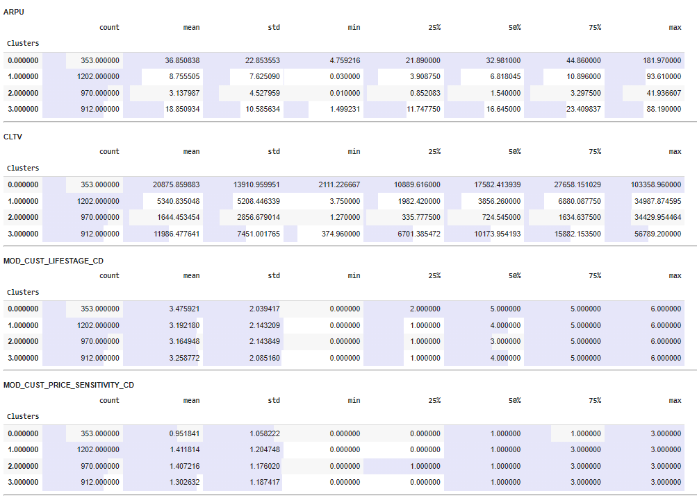
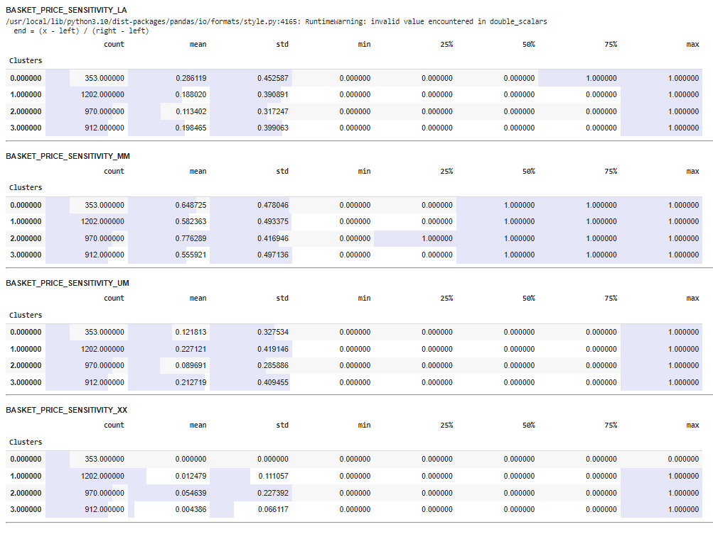
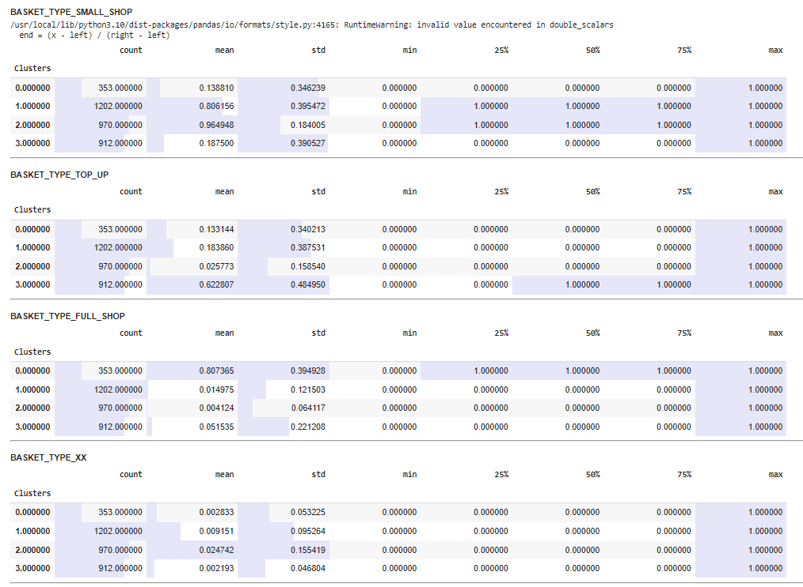
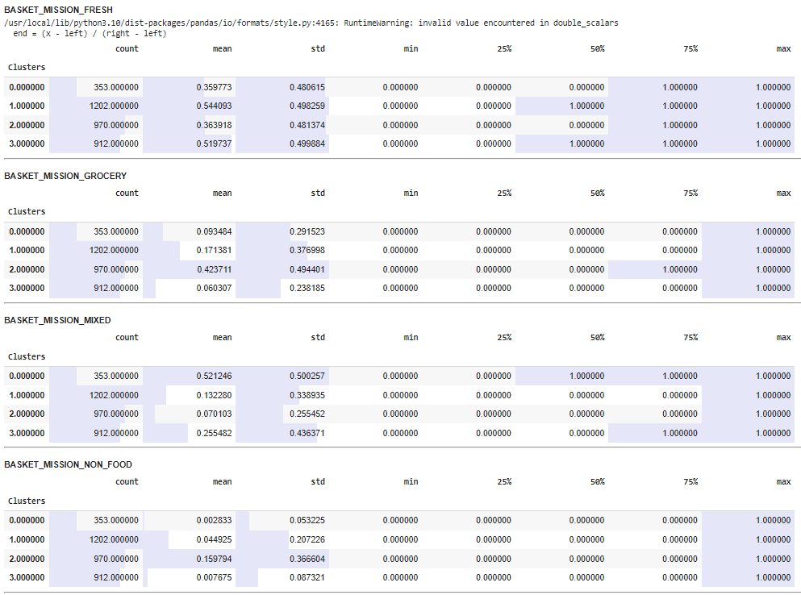
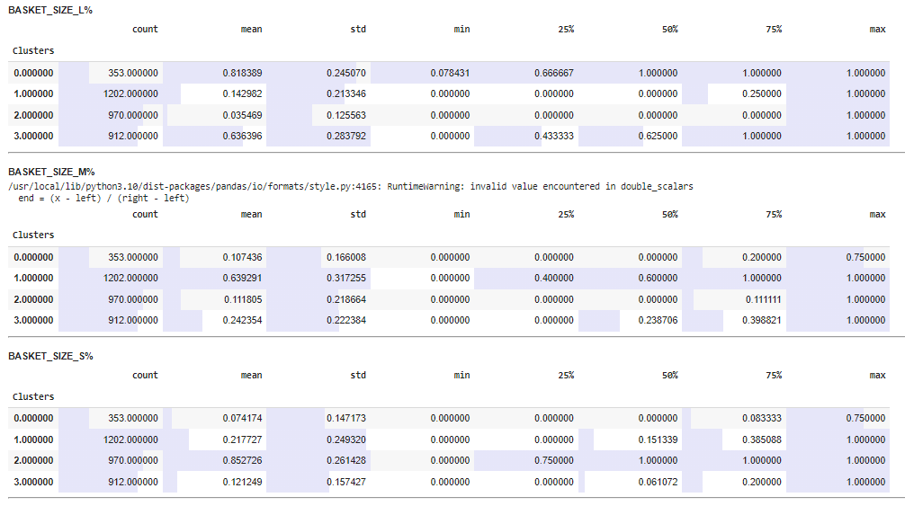
##### KDE
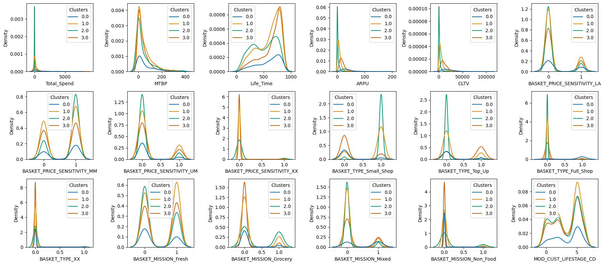
##### Bloxplot
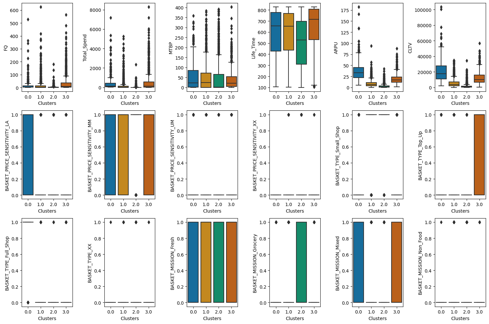
#### Feature Importance
With the cluster labels as classes to predict, train a Random Forest classifier.
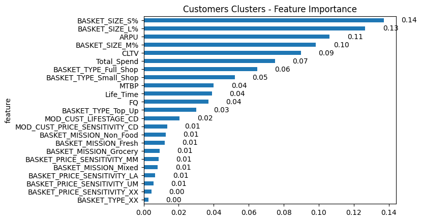 
## 5) Interpretation
