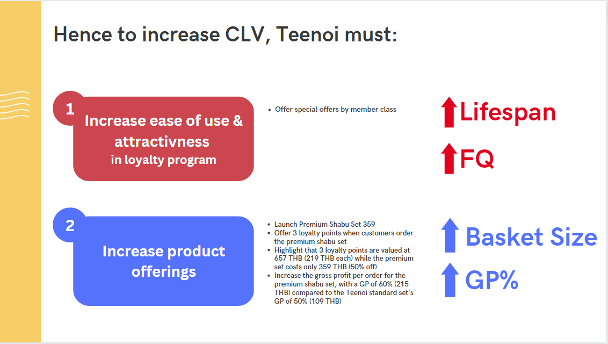
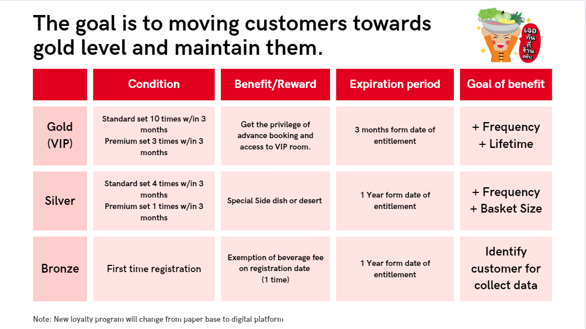
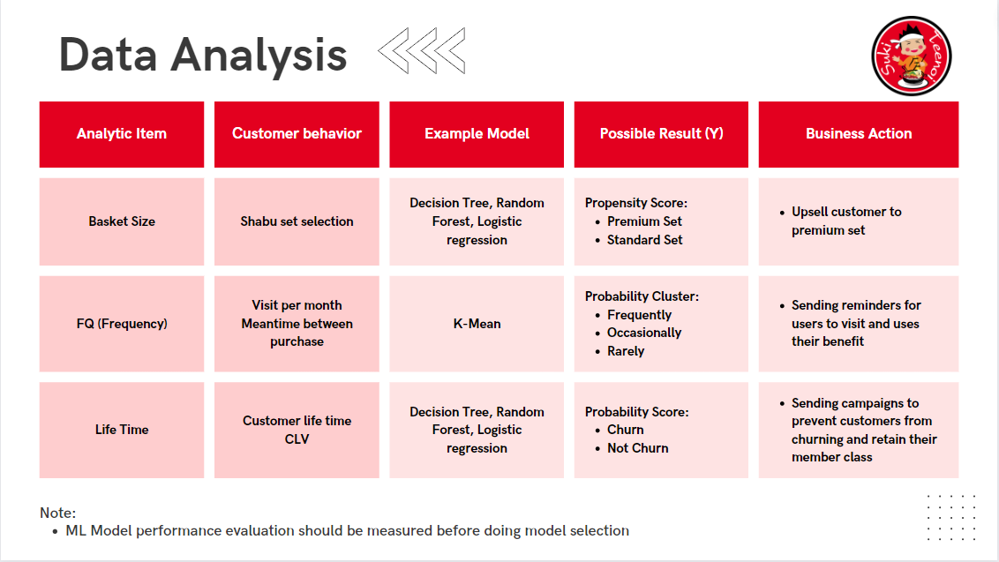
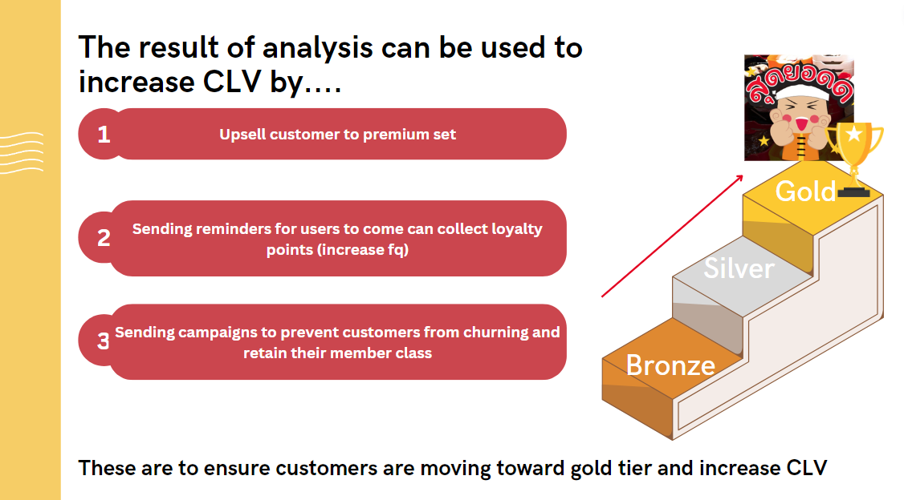

# CLV & Customer Scoring
    
The objective is to identify a business, analyze its existing loyalty program, and offer recommendations for improvement.
## Business Context: Suki Teenoi

"Suki Teenoi" is considered a popular and rapidly growing sukiyaki restaurant. Despite the COVID-19 situation, its revenue and profitability remain strong. In the year 2022, Suki Tienoi has been in operation for 5 years, with a total of 42 branches under the Suki Teenoi brand, an increase from 36 branches in 2021. The branches are located in Bangkok and its surrounding provinces. The restaurant aims to meet the demands of buffet-style sukiyaki lovers by providing high-quality, delicious food at a reasonable price. Currently, Suki Teenoi offers its buffet at 219 baht per person.
  
Currently, Suki Teenoi has a loyalty program in the form of a membership card for devoted fans. The accumulation condition is earning 1 point for each visit to the shop, and once 15 points have been accumulated, customers receive a membership card. The exclusive privilege of the membership card allows for a 50% discount on food when dining in the birth month. This privilege extends to the cardholder and one accompanying person.

## Problem Statement
Suki Teenoi is facing challenges to increase customer lifetime value due to:
1. Lack of customer insights:
   - The loyalty program is not well-known, resulting in fewer sign-ups and an inability to gather customer data.
   - The loyalty program offers limited privileges, currently only providing discounts on birthdays, thus lacking incentives for enrollment.
2. Dependency on visit frequency for growth:
   - The only way to increase customer lifetime value is by increasing the number of visits since the products are priced at a fixed amount of 219 THB.
     
## Customer Lifetime Value (CLV)
CLV is a metric that estimates the total revenue a customer is likely to generate throughout their relationship with your company. 
One commonly used formula is CLV = (Average Basket Size x Margin% x Purchase Frequency) x Average Customer Lifespan.

## Segmentation by CLV
Segment the customers into groups using the following features: 
* `CLV`
*  `Meantime Between purchase`
*  `Avg basket size`
*  `Total visit per month (avg last 3 months)`
*  `% Standard Set Bought`
*  `% Premium Set Bought`
*  `lifetime`

    Machine Learning such as classifications model can be used to segment customers into groups. Classification algorithms can help segment customers into different groups based on their CLV scores. Algorithms like decision trees, random forests, or support vector machines can learn from historical customer data and assign customers to appropriate segments based on their characteristics and CLV potential.
  
## Customer Scoring Criteria
Developing a customer scoring system utilizing Customer Lifetime Value (CLV) can provide significant insights and enable effective customer segmentation based on their long-term value to Suki Teenoi. By assigning scores based on key classification features, such as the number of visits and the percentage of premium set purchases, we can establish a scoring framework:
 
* each visit (frequency) = 1 point earned.
* each premium set purchase (larger basket size) = 3 points earned. 

## Loyalty Program Suggestion 
By using CLV as a basis for customer scoring, you can prioritize and personalize your interactions and marketing efforts. 
1. Tier Benefit 
2. Tailored promotions and retention 

## Expected Results
   

* [click here to go to presentation](https://www.canva.com/design/DAFmzt9ieBA/VlXMk0Wh3xlwTVII7BMUsA/view?utm_content=DAFmzt9ieBA&utm_campaign=designshare&utm_medium=link&utm_source=publishsharelink)
