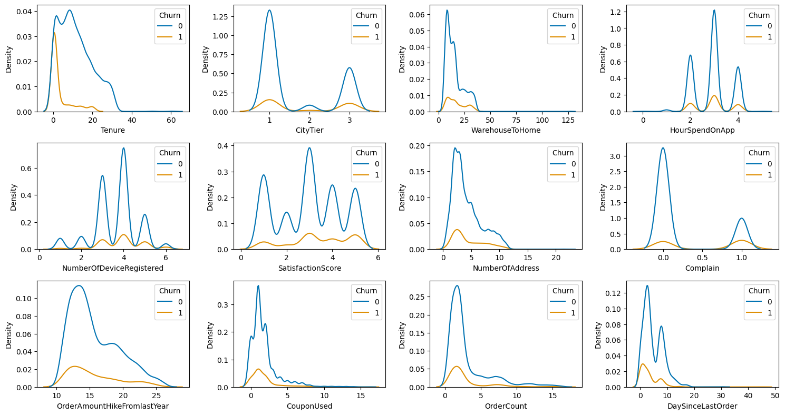
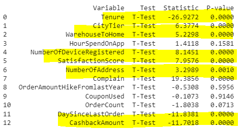

# Churn Scoring
   

**Notebooks:** [Classification Model](./ChurnScoring.ipynb)  
**Google Colab:** 

## 1) Import Dataset
The data is an ecommerce dataset including the following: 
- CustomerID	Unique = customer ID
- Churn = Churn Flag
- Tenure = Tenure of customer in organization
- PreferredLoginDevice = Preferred login device of customer
- CityTier = City tier
- WarehouseToHome = Distance in between warehouse to home of customer
- PreferredPaymentMode = Preferred payment method of customer
- Gender = Gender of customer
- HourSpendOnApp = Number of hours spend on mobile application or website
- NumberOfDeviceRegistered = Total number of deceives is registered on particular customer
- PreferedOrderCat = Preferred order category of customer in last month
- SatisfactionScore = Satisfactory score of customer on service
- MaritalStatus = Marital status of customer
- NumberOfAddress = Total number of added added on particular customer
- Complain = Any complaint has been raised in last month
- OrderAmountHikeFromlastYear = Percentage increases in order from last year
- CouponUsed = Total number of coupon has been used in last month
- OrderCount = Total number of orders has been places in last month
- DaySinceLastOrder = Day Since last order by customer
- CashbackAmount = Average cashback in last month

Number of observations: 5,630   
Number of variables: 20

## 2) EDA
EDA Shows that the data is quite imbalance between churn and not churn customers. 
### Frequency distribution of categorical variables:
  

### Summary statistics of numerical variables by Churn Flag:  

### Nurmerical variable distribution:
   

### Missing Value: 
-  `Tenure `                         264
-  `WarehouseToHome `                251
-  `HourSpendOnApp `                 255
-  `OrderAmountHikeFromlastYear `    265
-  `CouponUsed `                     256
-  `OrderCount `                     258
-  `DaySinceLastOrder `              307

* Based on KDE plot, there features (`Tenure ` , `WarehouseToHome `, `OrderAmountHikeFromlastYear ` , `CouponUsed ` , `OrderCount ` , `DaySinceLastOrder `) are skewed hence we used median to impute missing value
* For  `HourSpendOnApp ` , it is multinomial so we used mode to impute missing value

### Bivariate Analysis: 
Looks like almost all feature are significant to churn flag.

#### Cat-Cat
 
- PreferredLoginDevice: Chi-square statistic: 73.536 | P-value: 1.0756922373255213e-16
- PreferredPaymentMode: Chi-square statistic: 77.897 | P-value: 9.708708511076305e-15
- Gender: Chi-square statistic: 4.663 | P-value: 0.030820940334890086
- PreferedOrderCat: Chi-square statistic: 288.639 | P-value: 2.7708325346337454e-60
- MaritalStatus: Chi-square statistic: 188.671 | P-value: 1.073011277910542e-41

#### Cat-Num
 
 

#### Feature engineering 
turning categorical columns into numeric value using one-hot end technique. Unique values for column:
- `PreferredLoginDevice`:['Mobile Phone' 'Phone' 'Computer']
- `PreferredPaymentModev`:['Debit Card' 'UPI' 'CC' 'Cash on Delivery' 'E wallet' 'COD' 'Credit Card']
- `Gender`: ['Female' 'Male']
- `PreferedOrderCat`: ['Laptop & Accessory' 'Mobile' 'Mobile Phone' 'Others' 'Fashion' 'Grocery']
- `MaritalStatus`:['Single' 'Divorced' 'Married']
  
## 3) Model Creation & Evaluation
- Model Used: 'Logistic Regression', 'Random Forest', 'KNeighbors','XGBoost'
- Fixing Imbalance Technique: none, under sampler, over sampler, SMOTE
- The best performing Model: XGBoost, Sampler: Over_Sampler

 
  
## 4) Result Feature Importance
The best performing Model: XGBoost, Sampler: Over_Sampler
### confusion matrix  

### ROC-AUC  

### evaulation  

### feature importance  

