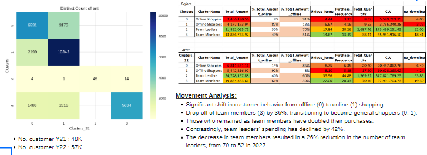

# Customer Segmentation & Segment Movement Analysis
      

# 0) Project Overview

# 1) Import Dataset
# 2) Create single customer view

# 3) Clustering
**Notebooks:** [Clustering Model](./V2_1_HDI_Segmentation.ipynb)  
**Google Colab:** 
#### Features
All the features are taken from single customer view table
#### Choosing K number of clusters
Choose `K = 4` with the lowest silhoette score of 0.26

#### Clustering Result

#### Feature Importance
With the cluster labels as classes to predict, train a Random Forest classifier.

#### Cluster Interpretation

With xxx

# 4) Classification
**Notebooks:** [Classification Model](./ChurnScoring.ipynb)  
**Google Colab:** .ipynb)
#### Model Evaluation
#### Model Results

# 5) Segment Movement Analysis

