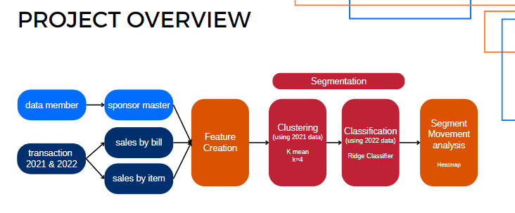
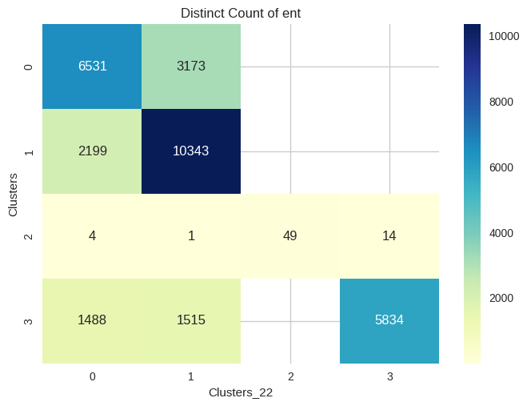

# Customer Segmentation & Segment Movement Analysis
      

# 0) Project Overview

# 1) Import Dataset
HDI was started in 1986 by Mr. Peter Chia, who desired to provide a better life for his family. HDI emerged as a trailblazer in the development of the Network Marketing Business in Asia, specifically in Singapore, Malaysia, Indonesia, Hong Kong, and the Philippines. The company offers natural products from bee, they  have five main categories, namely supplements for adult & Kid, personal care, skincare, food and beverages.
## Dataset
1. data member : master data of downline and his/her sponsor
2. transaction 2021 - 2022 : contains sales by bill from year 2021 to 2022

# 2) Create single customer view

# 3) Clustering
**Notebooks:** [Clustering Model](./V2_1_HDI_Segmentation.ipynb)  
**Google Colab:** 
#### Features
All the features are taken from single customer view table
#### Choosing K number of clusters
Choose `K = 4` with the lowest silhoette score of 0.26

#### Clustering Result

#### Feature Importance
With the cluster labels as classes to predict, train a Random Forest classifier.

#### Cluster Interpretation

# 4) Classification
**Notebooks:** [Classification Model](./V2_2_HDI_Classification%20(1).ipynb)  
**Google Colab:** .ipynb)
#### Model Evaluation

#### Model Results

# 5) Segment Movement Analysis

Movement Analysis:
- Significant shift in customer behavior from offline (0) to online (1) shopping.
- Drop-off of team members (3) by 36%, transitioning to become general shoppers (0, 1).
- Those who remained as team members have doubled their purchases.
- Contrastingly, team leaders' spending has declined by 42%.
- The decrease in team members resulted in a 26% reduction in the number of team leaders, from 70 to 52 in 2022.
