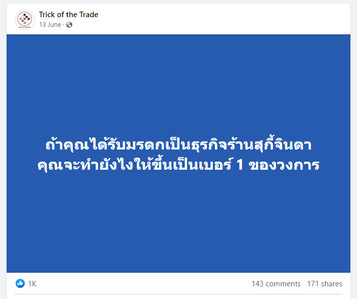
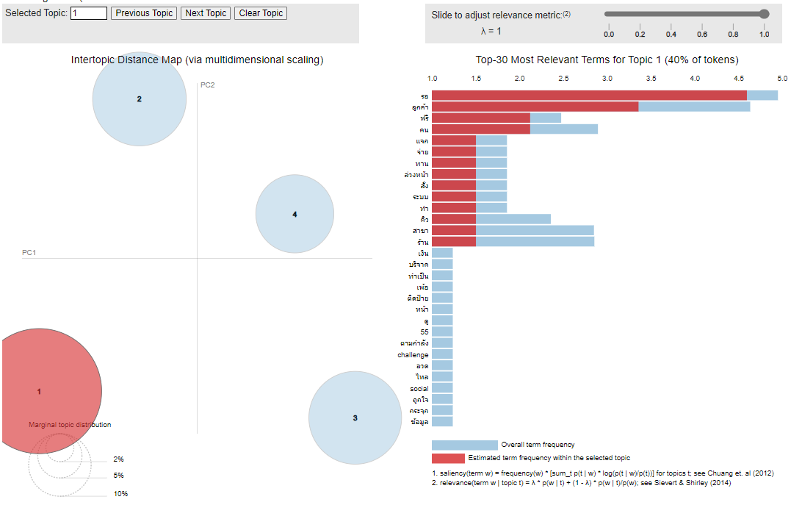
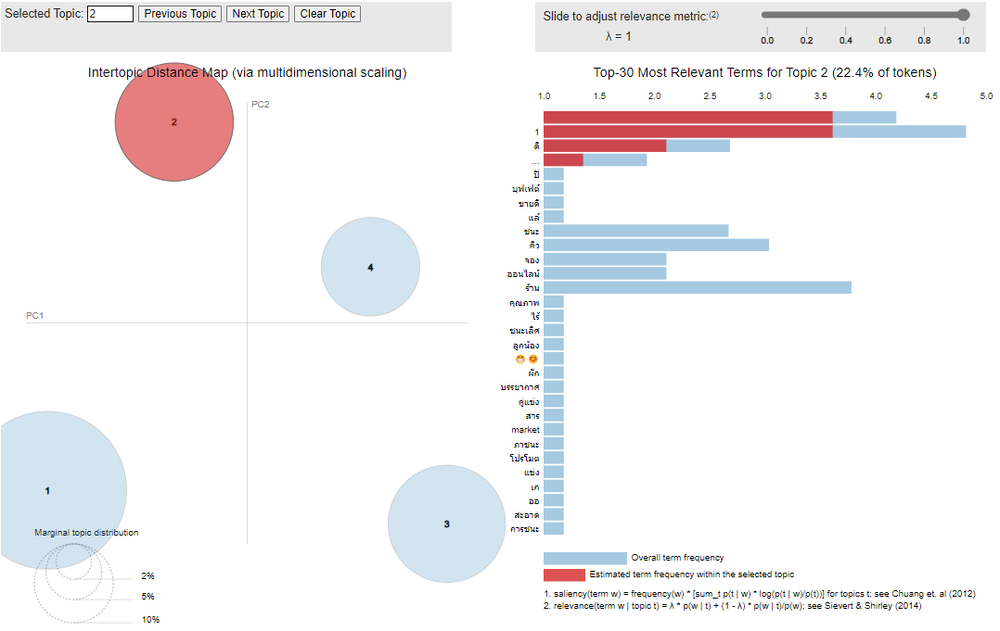
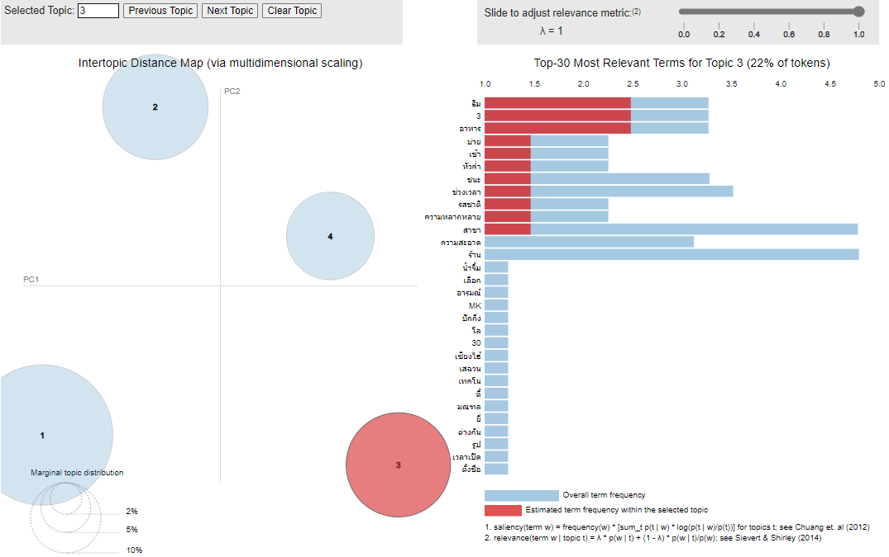
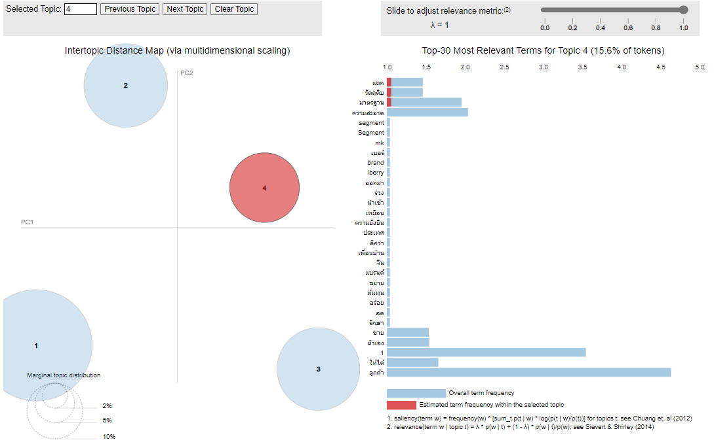

# Topic Modeling
    

# 0) Project Overview
This project aims to perform topic modeling on a Facebook post's comments using Natural Language Processing (NLP) techniques. By analyzing a sample of 15 comments from a selected post, the goal is to uncover underlying themes or topics within the comments, providing valuable insights into the discussions and interests of the users.
     

# 1) Topic Modeling
**Notebooks:** [Topic Modeling](./TopicModeling.ipynb)  
**Google Colab:** 

# 2) Result analysis
## Topic 1: Improve Customer Experience by improving wait time and queue management
 
## Topic 2: Noise (To be exclude from analysis)
 
## Topic 3: Menu Variety
 
## Topic 4: Maintain Ingredient quality
 

# 3) Business Recommendation
To maintain competitiveness and secure the top brand position, the company should prioritize enhancing the customer experience by addressing extended waiting times, diversifying the menu offerings, and ensuring consistent ingredient quality. Additionally, expanding the sample size for analysis will yield more robust topics that can provide valuable insights into the broader customer population's preferences and sentiments.
