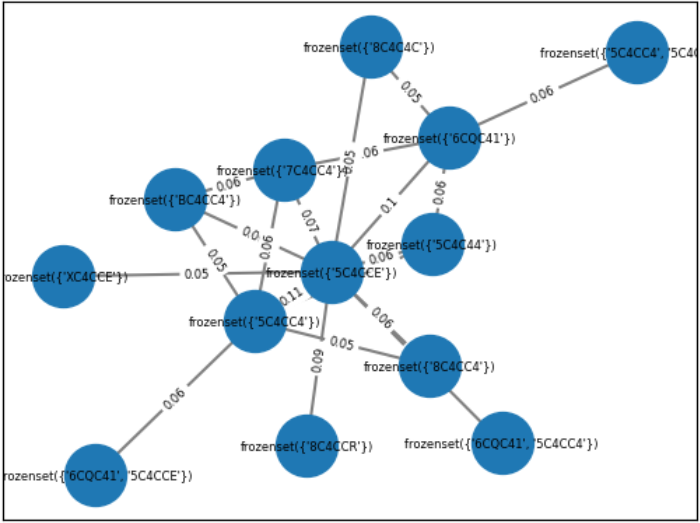
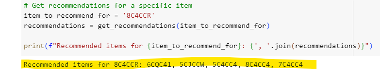

# Customer Product Recommendations

 
   

# 1) Dataset
HDI was started in 1986 by Mr. Peter Chia, who desired to provide a better life for his family. HDI emerged as a trailblazer in the development of the Network Marketing Business in Asia, specifically in Singapore, Malaysia, Indonesia, Hong Kong, and the Philippines. The company offers natural products from bee, they  have five main categories, namely supplements for adult & Kid, personal care, skincare, food and beverages.
#### Provided Dataset
1. data member : master data of downline and his/her sponsor
2. transaction 2021 - 2022 : contains sales by bill from year 2021 to 2022
#### Created Dataset
1. sponsor master : master data of sponsor and no. of downline per sponsor
2. salesbyitem 2021 - 2022 : extract json product file to sales quantiy by item

# 2) Project Scope
This project focus on recommended additional product to those who is already buying top 20 products of HDI in 2021. 

# 3) Product Recommendation
**Notebooks:** [Product Recommendation](./ProductRecom1_top20.ipynb)  
**Google Colab:** 

## List of top product list: 
['5C4CCE', '5C4CC4', '8C4CCR', 'KCQCE4', 'XC4CCW', 'KCQCEC', '6CQC41', '7C4CC4', 'KC4CC4', 'BC4CC4', '5C4CEC', '8C4CC4', '8C4C4C', 'KCQCEE', '8C4CC3', '5C4C4W', 'XC4CCE', '8C4CCQ', '5CJCCW', 'KC4CQZ'] 

We find out from the graph below that '5C4CCE' is likely to be a free product, thus, we exclude it from the list. 

# 4) Recommendation Results
The heatmap below shows that products that have a high likelihood of being bought together are: 
1. XC4CCE - 5C4C4W
2. 8C4CCQ - 5C4C4W
3. XC4CCE - 8C4CCQ

## Recommendation algorithm
Using the user-item matrix to create cosine similarity, we can also create a function to perform the product recommendation of each user. For example: 

